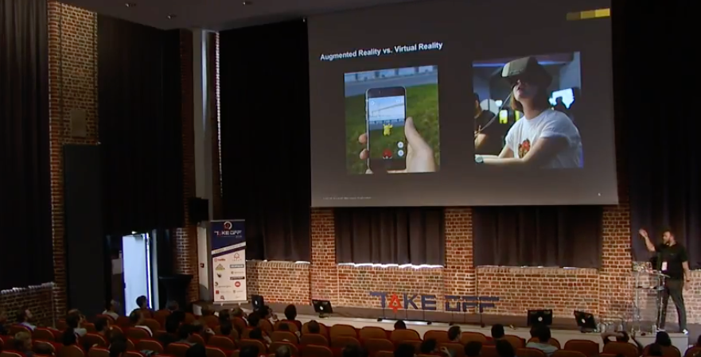
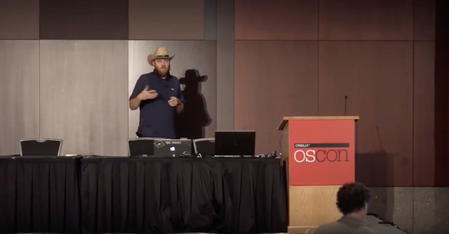

# Talks from Christian Grail

## 2018

### Frontend Connect in Warsaw, Poland
[Live Coding Session: Game Development with WebXR](https://frontend-con.io/speakers/#christian)

### AngularMix 2018 in Orlando, Florida
[How to convince your manager to go Open Source](https://angularmix.com/#!/speakers/Christian%20Grail)

### TechFest 2018 in Bucharest, Romania
[Live Coding: Augmented Reality Game with WebXR](https://2018.techfest.ro/techjam/)

### UI5con in St. Leon-Rot, Germany
[Live Coding: Augmented Reality Game with WebXR](https://openui5.org/ui5con/material2018.html)

### TakeOff Conf in Lille, France
[Game Development with WebAR](https://youtu.be/P99LOv23zZw)

### JAX 2018 in Mainz, Germany
[Developing an Augmented Reality Game in UI5 with ARCore for Web](https://jax.de/web-development-javascript/developing-an-augmented-reality-game-in-ui5-with-arcore-for-web/)

## 2017

### Google Developer Group Karlsruhe DevFest 2017 in Karlsruhe, Germany
[Augmented Reality Game Development - Live Coding Session](http://www.devfestka.de/info)

### SAP d-kom 2017 in Karlsruhe, Germany
[nCounter − Exploring Business Data in Multidimensional Space](https://experience.sap.com/news/sap-wins-ux-design-award-with-data-encounter/)

## 2016

### EclipseCon 2016 in Reston, Virginia
[How to convince your manager to go Open Source and build an open community](https://www.eclipsecon.org/na2016/session/how-convince-your-manager-go-open-source-and-build-open-community-eclipse-iot.html)

### O'Reilly OSCON in Austin, Texas
[How to convince your manager to go open source](https://www.oreilly.com/library/view/oscon-2016-video/9781491965153/video247467.html)

### SAP d-kom 2016 Silicon Valley at the Santa Clara Convention Center, California
Need for Speed: How to optimize the Performance of SAP UI5 applications

### SAP d-kom 2016 Silicon Valley at the Santa Clara Convention Center, California
How to convince your manager to go Open Source

## 2015

### SAP d-kom 2015 Silicon Valley in San Mateo, California
Learn from the best in the cloud - Continuous Delivery and DevOps

### SAP d-kom 2015 Silicon Valley in San Mateo, California
Faster development with Grunt (SAP UI5/Angular)

## 2014

### EclipseCon 2014 at Hyatt Regency San Francisco Airport, California
[CODE MATTERS - ECLIPSE HACKER'S GIT GUIDE](http://www.eclipsecon.org/na2014/session/code-matters-eclipse-hackers-git-guide.html)

## 2012

### SAP d-kom 2012 in Karlsruhe
- Winner of the InnoJam

