# Christian Grail

Christian Grail is a Development Architect at SAP in Germany. With the SAP Design team he works on frontrunner projects in the Enterprise space. Christian has spent some time in the Silicon Valley working on projects like [BUILD](https://www.build.me/) a complete set of cloud-based tools to design and build enterprise apps and the new [SuccessFactors People Profile](https://www.youtube.com/watch?v=0uIApuOxG8A) for SAP's cloud-based HCM solution . Currently he is working on exciting new projects like [DataEncounter](https://experience.sap.com/news/sap-wins-ux-design-award-with-data-encounter/) an award winning 3D Big Data exploration tool which utilizes Augmented and Virtual Reality and [SAP Inscribe](https://news.sap.com/2018/06/sap-inscribe-bottom-up-innovation-story/) a handwriting and Machine Learning based Conversational Digital Assistant.

Connect with me on [LinkedIn](https://www.linkedin.com/in/cgrail/) or follow me on [Twitter](https://twitter.com/cgrail)

# Talks from Christian Grail

## 2019

### JavaLand in Brühl, Germany

[Live Coding Session: Game Development with WebXR](https://programm.javaland.eu/2019/#/scheduledEvent/569913)

### Appdevcon in Amsterdam, Netherlands

[ARKit Game Development Tutorial](ARKit Game Development Tutorial)

### heise c't \<webdev\> in Köln, Germany

[Live Coding Session: Game Development with WebXR](https://ctwebdev.de/programm.html#slot-18)

[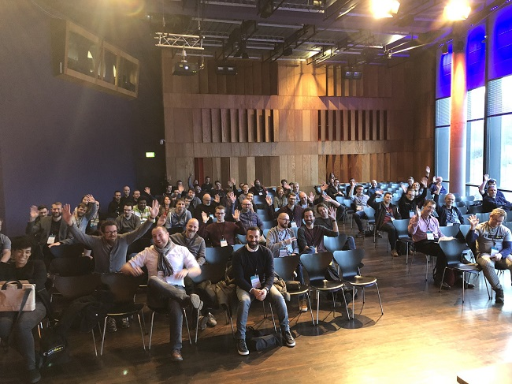](https://ctwebdev.de/programm.html#slot-18)

[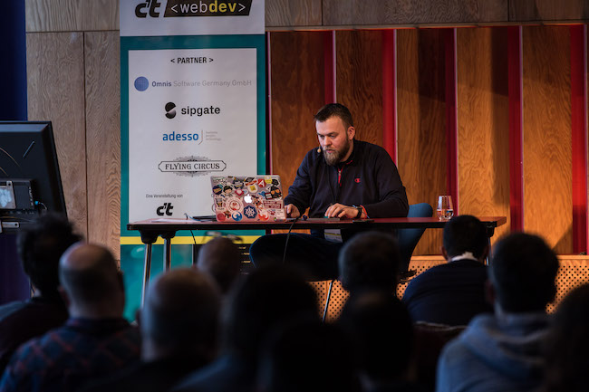](https://ctwebdev.de/programm.html#slot-18)

### iOS Conference in Singapore

[Live Coding: Augmented Reality Game with ARKit](https://2019.iosconf.sg/schedule/#session-112)

[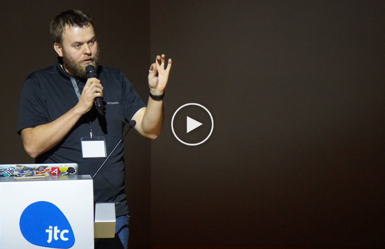](https://youtu.be/Q91z42kTJFM)

## 2018

### AngularMix 2018 in Orlando, Florida
[How to convince your manager to go Open Source](https://angularmix.com/#!/speakers/Christian%20Grail)

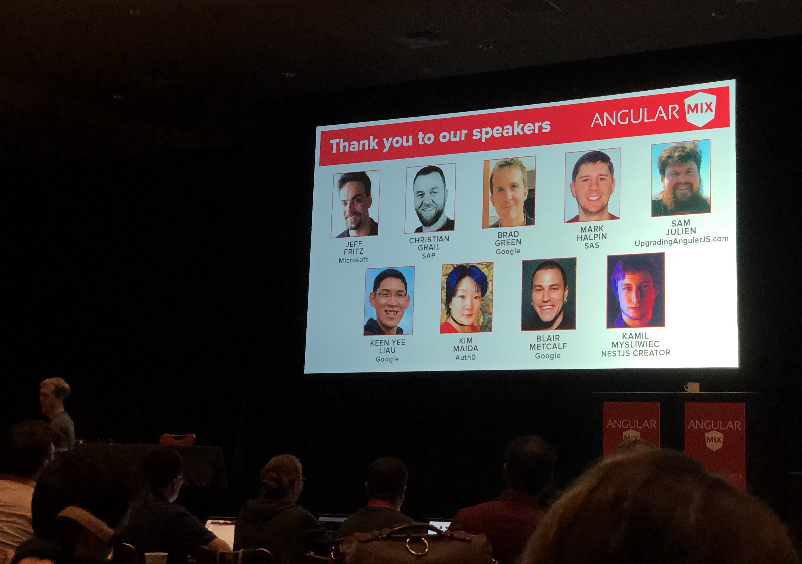

### TechFest 2018 in Bucharest, Romania
[Live Coding: Augmented Reality Game with WebXR](https://2018.techfest.ro/techjam/)

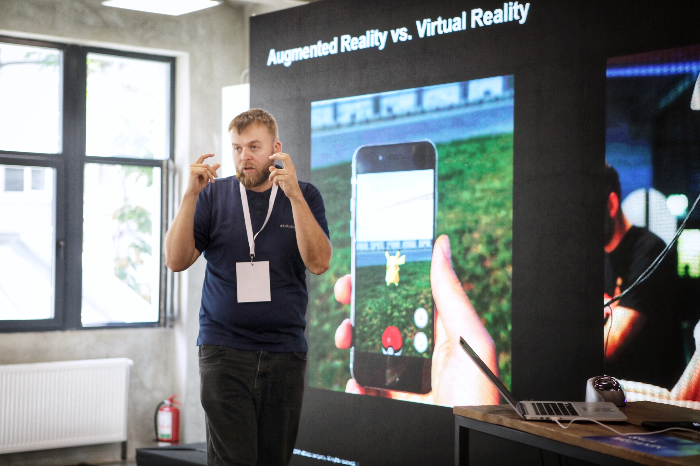

### UI5con in St. Leon-Rot, Germany
[Live Coding: Augmented Reality Game with WebXR](https://openui5.org/ui5con/material2018.html)

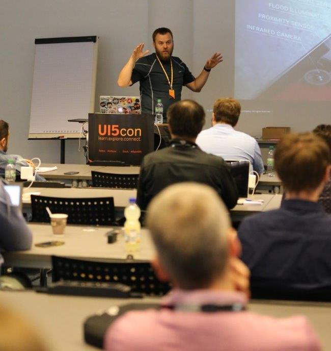

### TakeOff Conf in Lille, France
[Game Development with WebAR](https://youtu.be/P99LOv23zZw)

[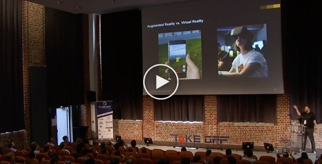](https://youtu.be/P99LOv23zZw)

### JAX 2018 in Mainz, Germany
[Developing an Augmented Reality Game in UI5 with ARCore for Web](https://jax.de/web-development-javascript/developing-an-augmented-reality-game-in-ui5-with-arcore-for-web/)

## 2017

### Google Developer Group Karlsruhe DevFest 2017 in Karlsruhe, Germany
[Augmented Reality Game Development - Live Coding Session](http://www.devfestka.de/info)

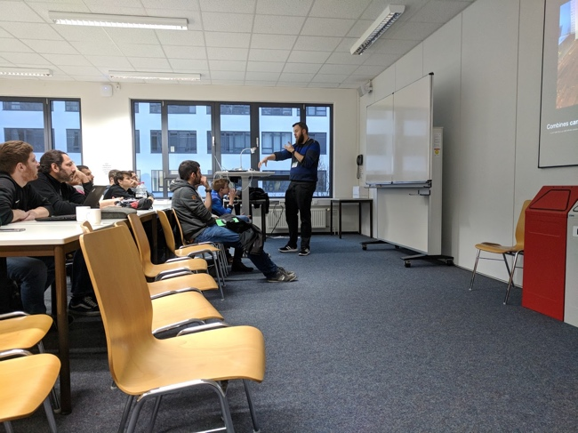

### SAP d-kom 2017 in Karlsruhe, Germany
[nCounter − Exploring Business Data in Multidimensional Space](https://experience.sap.com/news/sap-wins-ux-design-award-with-data-encounter/)

## 2016

### EclipseCon 2016 in Reston, Virginia
[How to convince your manager to go Open Source and build an open community](https://www.eclipsecon.org/na2016/session/how-convince-your-manager-go-open-source-and-build-open-community-eclipse-iot.html)

### O'Reilly OSCON in Austin, Texas
[How to convince your manager to go open source](https://conferences.oreilly.com/oscon/oscon-tx-2016/public/schedule/detail/49103)

[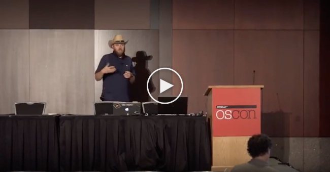](https://www.oreilly.com/library/view/oscon-2016-video/9781491965153/video247467.html)

### SAP d-kom 2016 Silicon Valley in Santa Clara, California
Need for Speed: How to optimize the Performance of SAP UI5 applications

### SAP d-kom 2016 Silicon Valley in Santa Clara, California
How to convince your manager to go Open Source

## 2015

### SAP d-kom 2015 Silicon Valley in San Mateo, California
Learn from the best in the cloud - Continuous Delivery and DevOps

### SAP d-kom 2015 Silicon Valley in San Mateo, California
Faster development with Grunt (SAP UI5/Angular)

## 2014

### EclipseCon 2014 in in Burlingame, California
[Code Matters - Eclipse Hackers Git Guide](http://www.eclipsecon.org/na2014/session/code-matters-eclipse-hackers-git-guide.html)

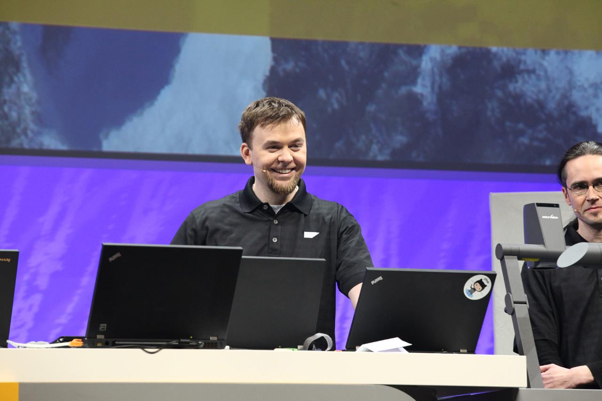

## 2012

### SAP d-kom 2012 in Karlsruhe
[Quick Resolve presentation](https://blogs.sap.com/2012/03/28/and-the-winner-is-pre-dkom-innojam-2012-rot-is-over-now/)

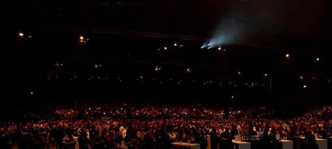
