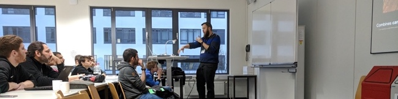

# Christian Grail

Christian Grail is a Development Architect at SAP in Germany. Christian has developed apps with traditional and futuristic user interfaces like AR, VR and handwriting based UIs. Christian is a full stack developer with experience in Swift, Java, C#, and JavaScript. He is a core maintainer of the open-source and crowd-sourced technical conference and CFP list [www.confs.tech](https://confs.tech) on [Github](https://github.com/tech-conferences/conference-data).

Connect with Christian Grail on [linkedin.com/in/cgrail](https://www.linkedin.com/in/cgrail/) or follow him on [twitter.com/cgrail](https://twitter.com/cgrail)

# Projects from Christian Grail

Here are a few projects I have been working over the last few years

[SAP Inscribe](https://news.sap.com/2018/06/sap-inscribe-bottom-up-innovation-story/) a handwriting and machine learning based Conversational Digital Assistant


[DataEncounter](https://ux-design-awards.com/de/gewinner/data-encounter) an award winning 3D Big Data exploration tool which utilizes AR and VR


[BUILD](https://www.build.me/) a complete set of cloud-based tools to design and build enterprise apps


# Talks from Christian Grail

## 2021

### WeAreDevelopers World Congress

[Live Coding: Augmented Reality Game with WebXR](https://www.youtube.com/watch?v=8xQRO_VIZdI)

## 2019

### SAP TechEd Las Vegas NV, USA

Develop an Augmented-Reality Web App with SAPUI5 and WebXR

### SAP TechEd Barcelona, Spain

Develop an Augmented-Reality Web App with SAPUI5 and WebXR

### Halfstack Vienna, Austria

[Live Coding: Augmented Reality Game with WebXR](https://halfstackconf.com/vienna/schedule/)

### JavaLand in Brühl, Germany

Live Coding Session: Game Development with WebXR

### Appdevcon in Amsterdam, Netherlands

[ARKit Game Development Tutorial](https://appdevcon.nl/session/arkit-game-development-tutorial/)

### heise c't \<webdev\> in Köln, Germany

[Live Coding Session: Game Development with WebXR](https://ctwebdev.de/2019.html#slot-18)

### iOS Conference in Singapore

[Live Coding: Augmented Reality Game with ARKit](https://2019.iosconf.sg/schedule/#session-112)



## 2018

### AngularMix 2018 in Orlando FL, USA

How to convince your manager to go Open Source

### TechFest 2018 in Bucharest, Romania

Live Coding: Augmented Reality Game with WebXR

### UI5con in St. Leon-Rot, Germany

[Live Coding: Augmented Reality Game with WebXR](https://openui5.org/ui5con/germany2019/material2018.html)

### TakeOff Conf in Lille, France

[Game Development with WebAR](https://youtu.be/P99LOv23zZw)



### JAX 2018 in Mainz, Germany

[Developing an Augmented Reality Game in UI5 with ARCore for Web](https://jax.de/web-development-javascript/developing-an-augmented-reality-game-in-ui5-with-arcore-for-web/)

## 2017

### Google Developer Group Karlsruhe DevFest 2017 in Karlsruhe, Germany

Augmented Reality Game Development - Live Coding Session

### SAP d-kom 2017 in Karlsruhe, Germany

nCounter − Exploring Business Data in Multidimensional Space

## 2016

### EclipseCon 2016 in Reston VA, USA

How to convince your manager to go Open Source and build an open community

### O'Reilly OSCON in Austin TX, USA

How to convince your manager to go open source](https://web.archive.org/web/20200808031029/https://conferences.oreilly.com/oscon/oscon-tx-2016/public/schedule/detail/49103)

### SAP d-kom 2016 Silicon Valley in Santa Clara CA, USA

Need for Speed: How to optimize the Performance of SAP UI5 applications

### SAP d-kom 2016 Silicon Valley in Santa Clara CA, USA

How to convince your manager to go Open Source

## 2015

### SAP d-kom 2015 Silicon Valley in San Mateo CA, USA

Learn from the best in the cloud - Continuous Delivery and DevOps

### SAP d-kom 2015 Silicon Valley in San Mateo CA, USA

Faster development with Grunt (SAP UI5/Angular)

## 2014

### EclipseCon 2014 in in Burlingame CA, USA

[Code Matters - Eclipse Hackers Git Guide](https://docs.google.com/presentation/d/18TWTGsC2cTkPfsNaP2LizRAMGsy8zkiGF2UblHk2L60)

## 2012

### SAP d-kom 2012 in Karlsruhe

[Quick Resolve presentation](https://blogs.sap.com/2012/03/28/and-the-winner-is-pre-dkom-innojam-2012-rot-is-over-now/)

